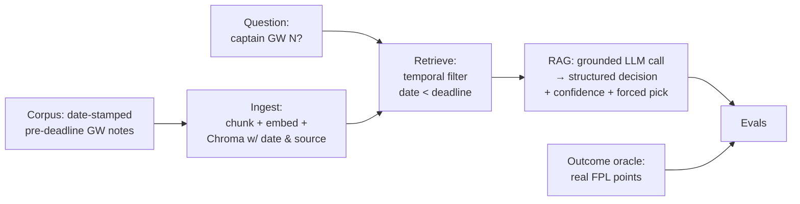
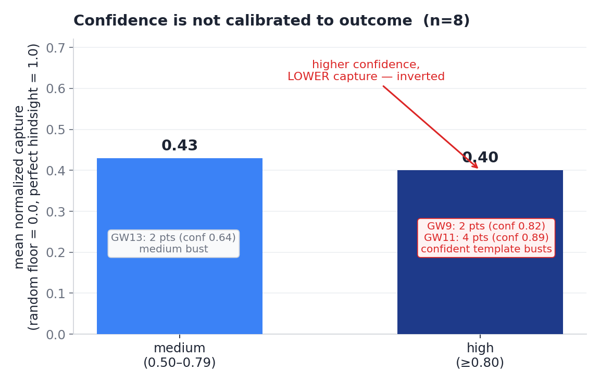
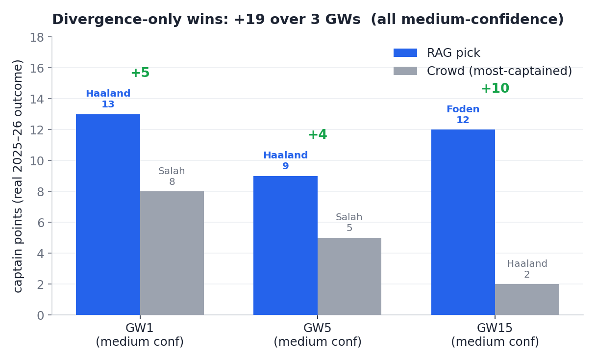

# fpl-retro-rag-evals

> A retrieval system that makes Fantasy Premier League captaincy decisions — and a set of evaluations rigorous enough to catch when it's wrong.

## TL;DR

A retrospective RAG system that recommends FPL captains from a date-stamped corpus of pre-deadline gameweek notes, evaluated against the **real outcomes** of the completed 2025–26 Premier League season.

What I found:
- On the gameweeks where it **diverged** from the crowd, the system beat the "captain whoever everyone else captains" baseline by **+19 captain points** over 3 divergent weeks (n=8, directional — not a significance claim).
- A headline result I first reported was a **lucky single run**. Running each decision many times and taking the majority vote exposed it — and changed how I measure everything.
- The system's **confidence signal is not trustworthy**: its most-confident picks did *no better* (slightly worse) than its least-confident ones. Its edge lives in the calls it's *unsure* about.

The interesting part of this project isn't that the RAG works. It's the evals — they're built to catch the system lying, and twice, they did.

**Stack:** Python · Chroma · sentence-transformers (all-MiniLM-L6-v2) · Anthropic Claude (Haiku) · pydantic

---

## Why this project exists

Most portfolio RAG demos evaluate **retrieval quality** — "are the retrieved chunks relevant?" — usually with an LLM-as-judge. That's table stakes, and it's a question that can't really be wrong in a way that matters to a user.

I wanted to evaluate **decision quality**: did the retrieved context actually lead to a *better decision* than a naive baseline? That's a harder question, and it's normally impossible for a portfolio project because you have no ground truth. Here I do — the 2025–26 season is finished, so every captaincy decision has a real, knowable outcome (the points that player actually scored). The completed season is the ground truth most RAG projects can't access.

The domain is FPL captaincy: each week, pick one player to double, using only information available **before** that gameweek's deadline.

---

## Architecture



**The non-negotiable invariant — temporal integrity.** Any note used to decide gameweek N may contain only information available before GW N's deadline. No hindsight leakage. This is enforced as a metadata filter on every retrieval (`date < deadline`) and checked by a hard assertion in the eval.

A subtle but important distinction: the temporal rule constrains the **inputs** (the corpus). The **outcome oracle** — the real points used to grade a decision — is applied *after* the decision and is *allowed* to be "future" relative to the deadline. That's not leakage; it's the answer key.

**Why Chroma, not FAISS.** The invariant requires metadata filtering at query time (return only chunks whose `date` precedes GW N's deadline). Chroma supports `where` predicates on metadata natively; FAISS is a pure similarity index with no metadata filter. The eval invariant drives the architecture choice.

---

## Eval methodology

Three layers, tested in the order they stack:

**1. Retrieval eval** — does the system fetch the right notes? Measured with `hit@k` and `recall@k` against a hand-labelled golden set, plus a hard assertion that no retrieved note post-dates the deadline.
> **12 golden cases · 15 ground-truth notes across a 22-note corpus · k=5.** With the temporal filter ON: hit@5 **0.917** · recall@5 **0.875** (filter OFF: 0.833 / 0.792 — the filter *raises* the scores; see [Failure modes](#failure-modes-found)). Temporal-integrity assertion: **PASS**.

**2. Answer-quality eval (LLM-as-judge)** — a second model grades each answer on **groundedness** (does it rely on the retrieved notes, not the model's own knowledge?) and **correctness**, returning a pydantic-validated structured verdict. Over the 8 golden cases: aggregate **groundedness 5.00/5, correctness 4.75/5**. *Known limitation:* the judge is the same model class (Haiku) grading against this corpus — a documented leniency/self-consistency bias — so these near-perfect scores are treated as **indicative, not authoritative**. Validating the judge against human labels is listed as future work.

**3. Decision-quality eval (the headline layer)** — does using the system produce better captain picks than baselines, measured in real points?
- **Baselines:** the crowd template (`most_captained` that gameweek — what managers actually do), a perfect-hindsight ceiling, and a random floor.
- **Headline metric — the divergence-only differential:** the system is scored only on weeks where its pick *differs* from the crowd. On weeks it agrees, it adds nothing by definition, so counting those would hand it free credit for obvious picks. Isolating the divergences measures its real marginal value.
- **Reliability:** each decision is run K=5 times and the majority pick is taken; the model's **confidence** is recorded as data (never used to drop a pick).

---

## Findings

This is the part I'd actually want a reviewer to read. The result wasn't a clean win — it was two moments where the evals caught the system (and me) being wrong.

### Finding 1 — A single run will lie to you

My first decision-quality run produced a clean **+10**: on GW15 the system diverged from the crowd to captain the in-form midfielder over a cooled premium, and won big.

Then I ran it many times instead of once. An earlier design let the model *abstain* on close calls — and on that same gameweek it declined to commit on most runs; the winning pick only appeared on a minority of them. The +10 wasn't a result; it was the run I happened to look at. Even at temperature 0, LLM outputs drift, and a single-run eval reports noise dressed as a finding.

The fix had two parts: a **forced pick** ("if you had to commit, who?") **majority-voted over K runs**, and treating the model's **confidence as the close-call signal** that abstention used to carry — as data, not a refusal. This also pushed a redesign of the output itself — instead of a bare pick, the system now returns a structured **decision-support** object (the live candidates, the case for each grounded in the notes, a confidence score, and a single forced pick the eval can grade). The system gets to be honest about close calls *and* still produce something measurable. With forcing in place, every GW's majority pick is now **unanimous (100% vote share at K=5)**.

### Finding 2 — The system is confident when the pick is obvious, not when it's right

With reliability fixed, I checked whether the confidence score meant anything — i.e. whether high-confidence picks actually win more often than low-confidence ones (calibration).

They don't.



The high-confidence picks captured **0.40** of available value (floor = 0.0, ceiling = 1.0) versus **0.43** for the medium-confidence ones — flat, even mildly inverted. The reason is mechanical: every high-confidence week was a "captain the obvious premium" agreement with the crowd, and several of those obvious picks simply failed —

| Gameweek | Confidence | Bucket | Points |
|---|---|---|---|
| GW9  | 0.82 | high   | 2 |
| GW11 | 0.89 | high   | 4 |
| GW13 | 0.64 | medium | 2 |

Two of the four high-confidence weeks (GW9, GW11) busted outright, which is what drags the high bucket below the medium one; GW13 was a third template agreement that busted at medium confidence. Meanwhile, *every* week the system actually beat the crowd was a **medium-confidence divergence**. The edge lives in the uncertain calls, and the confidence signal points the wrong way: the model is confident when the choice is *obvious*, but obvious and correct aren't the same thing in a sport where the favourite blanks all the time.

### The numbers (n=8)



- **Divergence-only differential:** **+19** over 3 divergent gameweeks (GW1 +5, GW5 +4, GW15 +10)
- **Record vs crowd baseline:** 3W–0L–5T · **agreement rate 62%** (5/8) · all wins medium-confidence
- **Totals:** RAG **71** vs template **52** (ceiling 139, floor 25.3) · mean per GW RAG **8.9** vs template **6.5**
- **Sample:** GW 1, 5, 6, 8, 9, 11, 13, 15 — chosen *outcome-blind*, by decision shape and reconstructability, never by where the system would win

| GW | RAG pick | Pts | Crowd pick | Pts | Confidence | Result |
|---|---|---|---|---|---|---|
| 1  | Haaland | 13 | Salah   | 8  | 0.55 med  | **+5 (diverged)** |
| 5  | Haaland | 9  | Salah   | 5  | 0.62 med  | **+4 (diverged)** |
| 6  | Haaland | 16 | Haaland | 16 | 0.95 high | tie |
| 8  | Haaland | 13 | Haaland | 13 | 0.85 high | tie |
| 9  | Haaland | 2  | Haaland | 2  | 0.82 high | tie (bust) |
| 11 | Haaland | 4  | Haaland | 4  | 0.89 high | tie (bust) |
| 13 | Haaland | 2  | Haaland | 2  | 0.64 med  | tie (bust) |
| 15 | Foden   | 12 | Haaland | 2  | 0.63 med  | **+10 (diverged)** |

Every divergence win is *medium* confidence and the model flagged each a close call — directional evidence, not a confident verdict. RAG beats the crowd *only where it diverges*, and it diverges *only on calls it is itself unsure about*. (The +5 and +4 are RAG holding Haaland against a Salah template; the +10 is the GW15 form-vs-pedigree call, RAG taking Foden over a cooled Haaland.)

### A note on honesty (how the corpus was built)

Three things worth stating plainly, because they're the reason the numbers above can be trusted:

- The corpus started **synthetic** — and when I rebuilt it from real pre-deadline data, I found my original synthetic notes contained **factual errors** (City home to Burnley when they were away at Wolves; a "differential" who plays for the wrong club; the wrong "in-form" midfielder). That's concrete evidence that decision-quality claims cannot run on invented data; every graded note is now built from real, verifiable pre-deadline facts by a deterministic builder (`src/fpl_facts.py`), tagged `source: fpl-derived`, and retrieval for this eval is restricted to that source so no synthetic note can leak into a graded decision.
- Several gameweeks I *forecast* as interesting "toss-ups" (GW9, GW11) **collapsed into clearer calls** once the real facts were in. I let the facts overrule the forecast and rewrote the notes — rather than bending the data to preserve an interesting story.
- I also caught a real **temporal-integrity bug**: the deadline calendar was stale and the GW15 notes post-dated the actual deadline. Regenerating it from the authoritative bootstrap snapshot and re-dating the notes confirmed the underlying result still held — the defect was the date stamp, not the data.

---

## Limitations

- **Small sample.** n=8 is directional only — enough to expose behaviour and failure modes, not to support statistical significance. The +19 rests on three GWs, all won at *medium* confidence.
- **The judge is unvalidated** against human labels (same-model-class leniency caveat above).
- **Wins are confined to low-confidence divergences.** The open question is now sharper: does RAG ever win a divergence it is actually *confident* about? At n=8, it has not faced one.
- **Template entrenchment.** From GW3 on, the crowd's `most_captained` is Haaland almost every week, so "divergence" almost always means "not Haaland". A richer set of divergent shapes would stress the test harder.
- **Injury-pivot weeks aren't reconstructable** from the API snapshot (availability fields are live, not point-in-time) and need a manually-sourced corpus.
- **Double-gameweeks** are reconstructable (the snapshot has doubles at GW26/33/36) but represent a different decision shape, deliberately deferred.

## What's next

- Widen the real corpus toward a sample that supports significance — and a real calibration test.
- Add an xG-based baseline and a no-RAG LLM baseline (the latter explicitly labelled hindsight-contaminated, since the model's training partly covers the season).
- Validate the judge against human-labelled examples.
- A thin interface: an **eval dashboard** (the rigor made visible) and a **decision-support UI** built on the structured output the system already emits.

---

## Failure modes found

The retrieval eval (12 cases, k=5) surfaced two classes of failure. They are reported as found — the corpus was **not** adjusted to make any number look better.

**1. Hindsight leakage (the thing this project exists to catch).** With the temporal filter OFF, the GW1 query returned a top-5 made *entirely* of future-dated notes and missed the one correct note (hit@5 = 0 for that case). Turning the filter ON restored it and, across the whole set, *raised* the aggregate: hit@5 0.833 → 0.917, recall@5 0.792 → 0.875. The metrics improve under filtering precisely because the future notes had been outranking the legitimate earlier note — the temporal-integrity claim, demonstrated rather than asserted.

**2. Semantic-retrieval misses (embedding weakness, not temporal).** GW12 never retrieved `gw12-form-watch` — the question's vocabulary and the note's wording don't overlap enough for MiniLM to rank it (hit@5 = 0, both filter modes). GW19 retrieved only one of its two relevant notes (recall = 0.50). These are limits of the embedding search, left as documented findings rather than tuned away. Notably, the GW12 miss surfaced as an **honest refusal** ("the provided notes do not contain enough information to decide") rather than a hallucination — the intended grounding behaviour for a decision-support system.

---

## Repo layout

```
fpl-retro-rag-evals/
├── assets/             # README charts + their generator (make_charts.py)
├── data/
│   ├── corpus/         # date-stamped pre-deadline GW notes (.md)
│   ├── fpl/            # committed FPL API snapshot (the outcome oracle's source)
│   └── deadlines.json  # authoritative per-GW deadlines (the temporal cutoffs)
├── src/
│   ├── ingest.py       # chunk + embed + store (pydantic-validated frontmatter)
│   ├── retrieve.py     # similarity + temporal filter
│   ├── rag.py          # grounded answer → structured decision
│   ├── fpl_data.py     # outcome oracle, baselines, name resolver
│   ├── fpl_facts.py    # deterministic pre-deadline fact builder (fact-first authoring)
│   └── evals/
│       ├── golden.jsonl
│       ├── retrieval_eval.py
│       ├── judge.py
│       └── decision_quality.py
└── playground.py       # manual exploration: question → retrieved notes → answer
```

## Running it

```bash
pip install -r requirements.txt          # Python 3.12
# add ANTHROPIC_API_KEY to .env

python src/ingest.py                      # build the vector store
python src/evals/retrieval_eval.py        # retrieval: hit@k / recall@k + temporal assertion
python src/evals/decision_quality.py      # decision-quality + calibration
python playground.py "Who should I captain in GW8?" --gw 8   # poke it manually

python assets/make_charts.py              # regenerate the findings charts
```
